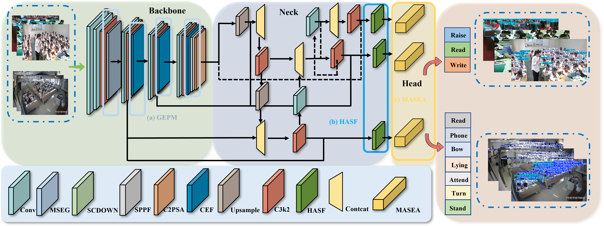
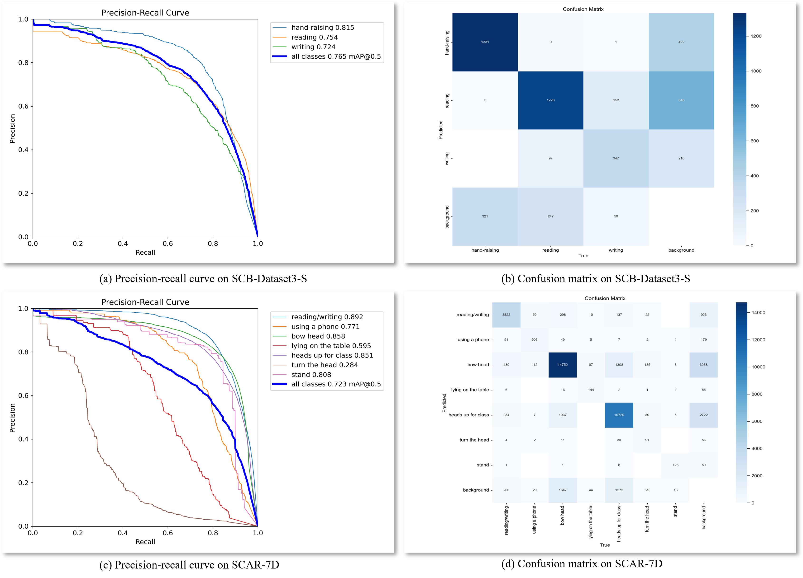

# GHM-YOLO
## Offcial implementation of "GHM-YOLO: An efficient detection model for classroom student behavior".


## 1. Dependencies
Install the `ultralytics` package, including all [requirements](https://github.com/ultralytics/ultralytics/blob/main/pyproject.toml), in a [**Python>=3.8**](https://www.python.org/) environment with [**PyTorch>=1.8**](https://pytorch.org/get-started/locally/).

[](https://pypi.org/project/ultralytics/) [](https://clickpy.clickhouse.com/dashboard/ultralytics) [](https://pypi.org/project/ultralytics/)

```bash
pip install ultralytics
```
## 2. Usage
### 2.1 Data preparation


We built a self-collected dataset named SCAR-7D (Student Classroom Activity Recognition Dataset with 7 Classes) to evaluate the generalization of our model in real classroom environments.
The dataset contains 100 lecture videos recorded under strict privacy compliance, covering pre-class, in-class, and post-class periods. Representative keyframes were extracted using a local-extrema frame-difference method (computed every 24 frames), filtering out irrelevant or low-variation frames. After preprocessing, 5,477 high-quality keyframes were obtained and carefully annotated with LabelImg into seven categories of classroom behaviors: reading/writing, using mobile phone, looking down, lying on desk, looking up, turning head, and standing.
## 3. Results

mAP@0.5 is the core indicator.

|     Model      | SCB-Dataset3-S | SCAR-7D | 
| :------------: | :-------: | :---------: | 
|    GHM-YOLO    |   76.5%   |    72.3%    | 

## Acknowledgment
The paper is under review and now needs to be kept confidential.

## Citation
The paper is under review and now needs to be kept confidential.
